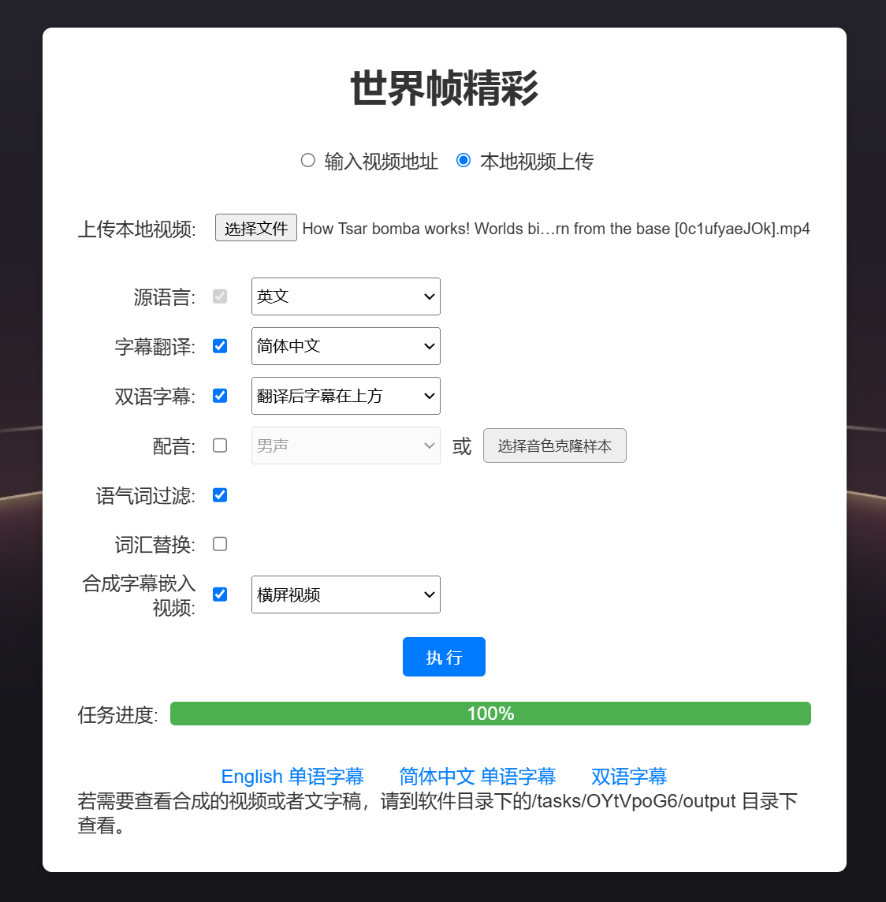

<div align="center">
  

  # 世界帧精彩

  <p>基于AI大模型的视频字幕翻译和配音工具，语音识别，智能断句，专业级翻译，一键部署全流程</p>
  <p>交流Q群: 754069680</p>

  其他语言: [English](./docs/README_en.md)

</div>

🚀 **项目简介**  

KrillinAI是一个为追求高质量视频翻译的用户和开发者设计的解决方案，提供从视频下载到最终成品的一站式工作流程，用AI赋能跨语言文化沟通。

## 主要特点与功能：
🎯 **一键启动**：无需复杂的环境配置，Krillin AI支持自动安装依赖，快速上手，立即投入使用  
📥 **视频获取**：集成yt-dlp，直接通过YouTube，Bilibili链接下载视频，简化素材收集过程，也可直接上传本地视频  
📜 **字幕识别和翻译**：支持OpenAI、阿里云等主流供应商的语音和大模型服务以及Faster Whisper本地模型（持续集成中）  
🧠 **智能字幕分割对齐**：利用自研算法对字幕进行智能分割和对齐，摆脱生硬的断句  
🔄 **自定义词汇替换**：支持一键替换词汇，适应特定领域语言风格  
🌍 **专业级翻译**：整段翻译引擎，确保上下文一致和语义连贯  
🎙️ **配音和声音克隆**：可选默认的男女生音色生成翻译后的视频朗读配音，或者上传本地音频样本克隆音色进行朗读  
📝 **配音对齐**：跨语言配音，也能与原字幕对齐  
🎬 **视频合成**：一键合成嵌入字幕的横屏和竖屏视频，自动处理宽度超限的字幕

## 语言支持
输入语言支持：中文，英文，日语，德语，土耳其语（持续增加中）

翻译语言支持：英文，中文，俄语，西班牙语，法语等56种语言

## 界面预览


## 效果展示
下图为46分钟的本地视频导入，一键执行后生成的字幕文件入轨后的效果，无任何手动调整。无缺失、重叠，断句自然，翻译质量也非常高。


<table>
<tr>
<td width="50%">

### 字幕翻译
---
https://github.com/user-attachments/assets/bba1ac0a-fe6b-4947-b58d-ba99306d0339

</td>
<td width="50%">


### 配音
---
https://github.com/user-attachments/assets/0b32fad3-c3ad-4b6a-abf0-0865f0dd2385

</td>
</tr>
</table>

## 快速开始
### 基本步骤
1. 下载[Release](https://github.com/krillinai/KrillinAI/releases)中与你设备系统匹配的可执行文件，放入空文件夹
2. 在文件夹内创建`config`文件夹，然后在`config`文件夹创建`config.toml`文件，复制源代码`config`目录下的`config-example.toml`文件的内容填入`config.toml`，并对照填写你的配置信息。
3. 双击，或在终端执行可执行文件，启动服务
4. 打开浏览器，输入`http://127.0.0.1:8888`，开始使用 (8888替换成你在配置文件中填写的端口)

### To: macOS用户
本软件没有做签名，因此在macOS上运行时，在完成“基本步骤”中的文件配置后，还需要手动信任应用，方法如下：
1. 在终端打开可执行文件（假设文件名是KrillinAI_1.0.0_macOS_arm64）所在目录
2. 依次执行以下命令：
   ```
    sudo xattr -rd com.apple.quarantine ./KrillinAI_1.0.0_macOS_arm64
    sudo chmod +x ./KrillinAI_1.0.0_macOS_arm64
    ./KrillinAI_1.0.0_macOS_arm64
    ```
    即可启动服务

### Docker部署
本项目支持Docker部署，请参考[Docker部署说明](./docs/docker.md)

### Cookie配置说明

如果你遇到视频下载失败的情况

请参考 [Cookie 配置说明](./docs/get_cookies.md) 配置你的Cookie信息。

### 配置帮助
最快速便捷的配置方式：
* `transcription_provider`和`llm_provider`都选择`openai`，这样在下方`openai`、`local_model`、`aliyun`三个配置项大类里只需要填写`openai.apikey`就可以进行字幕翻译。(`app.proxy`和`openai.base_url`按自己情况选填)

使用本地语言识别模型（暂不支持macOS）的配置方式（兼顾成本、速度与质量的选择）
* `transcription_provider`填写`fasterwhisper`，`llm_provider`填写`openai`，这样在下方`openai`、`local_model`三个配置项大类里只需要填写`openai.apikey`和`local_model.faster_whisper`就可以进行字幕翻译，本地模型会自动下载。(`app.proxy`和`openai.base_url`同上)

以下几种使用情况，需要进行阿里云的配置：
* 如果`llm_provider`填写了`aliyun`，需要使用阿里云的大模型服务，因此需要配置`aliyun.bailian`项的配置
* 如果`transcription_provider`填写了`aliyun`，或者在启动任务时开启了“配音”功能，都需要使用阿里云的语音服务，因此需要填写`aliyun.speech`项的配置
* 如果开启了“配音”功能，同时上传了本地的音频做音色克隆，则还需要使用阿里云的OSS云存储服务，因此需要填写`aliyun.oss`项的配置  
阿里云配置帮助：[阿里云配置说明](./docs/aliyun.md)

## 常见问题

请移步[常见问题](./docs/faq.md)

## 贡献规范
1. 不要提交无用文件，如.vscode、.idea等，请善于使用.gitignore过滤
2. 不要提交config.toml，而是使用config-example.toml提交

## Star History

[](https://star-history.com/#krillinai/KrillinAI&Date)
