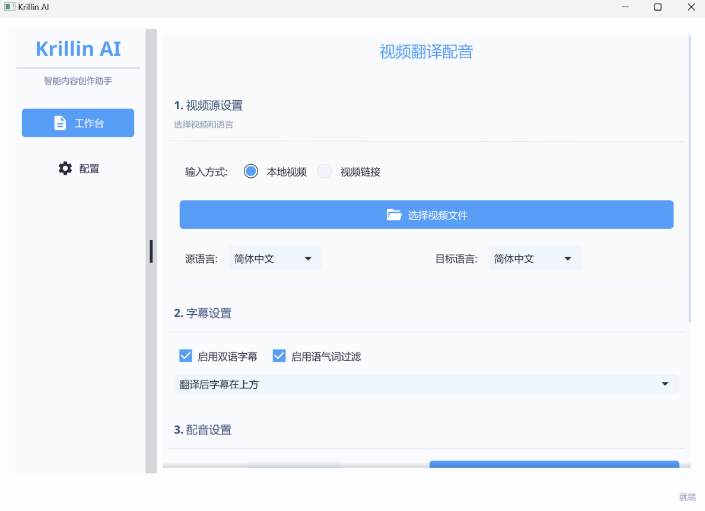

<div align="center">
  


  # KI-Audio- & Video-Übersetzungs- und Synchronisationstool

<a href="https://trendshift.io/repositories/13360" target="_blank"></a>

  **[English](../README.md)｜[简体中文](../docs/README_zh.md)｜[日本語](../docs/README_jp.md)｜[한국어](../docs/README_kr.md)｜[Tiếng Việt](../docs/README_vi.md)｜[Français](../docs/README_fr.md)｜[Deutsch](../docs/README_de.md)｜[Español](../docs/README_es.md)｜[Português](../docs/README_pt.md)｜[Русский](../docs/README_rus.md)｜[اللغة العربية](../docs/README_ar.md)**
  
  [](https://x.com/KrillinAI)
[](https://space.bilibili.com/242124650)
[](https://jq.qq.com/?_wv=1027&k=754069680)

</div>

### 📢 Neue Version für Windows & Mac Desktop – Willkommen zum Testen und Feedbackgeben

## Überblick

Krillin AI ist eine All-in-One-Lösung für mühelose Video-Lokalisierung und -Optimierung. Dieses minimalistisch gestaltete, aber leistungsstarke Tool übernimmt alles von Übersetzung, Synchronisation bis hin zu Sprachklonierung und Formatierung – es wandelt Videos nahtlos zwischen Quer- und Hochformat um, um eine optimale Darstellung auf allen Content-Plattformen zu gewährleisten (YouTube, TikTok, Bilibili, Douyin, WeChat Channel, RedNote, Kuaishou). Mit seinem End-to-End-Workflow verwandelt Krillin AI Rohmaterial in nur wenigen Klicks in aufbereitete, plattformfertige Inhalte.

## Hauptfunktionen:
🎯 **Ein-Klick-Start** - Sofortiger Workflow-Beginn, neue Desktop-Version noch benutzerfreundlicher!

📥 **Video-Download** - Unterstützt yt-dlp und lokale Datei-Uploads

📜 **Präzise Untertitel** - Hochgenaue Whisper-Erkennungstechnologie

🧠 **Intelligente Segmentierung** - LLM-basierte Unterteilungs- und Ausrichtungstechnologie

🌍 **Professionelle Übersetzung** - Absatzweise Übersetzung für konsistente Ergebnisse

🔄 **Begriffsersetzung** - Ein-Klick-Wechsel von fachspezifischem Vokabular

🎙️ **Synchronisation & Sprachklonierung** - CosyVoice-Stimmen oder individuelle Sprachklone

🎬 **Video-Zusammensetzung** - Automatische Formatierung für horizontale/vertikale Darstellungen

## Beispiel-Demo
Das folgende Bild zeigt das Ergebnis, nachdem die Untertiteldatei – generiert durch einen Ein-Klick-Vorgang nach Import eines 46-minütigen lokalen Videos – in die Spur eingefügt wurde. Es wurden keinerlei manuelle Anpassungen vorgenommen. Es gibt keine fehlenden oder überlappenden Untertitel, die Satzsegmentierung wirkt natürlich und die Übersetzungsqualität ist ebenfalls sehr hoch.


<table>
<tr>
<td width="33%">

### Untertitel-Übersetzung
---
https://github.com/user-attachments/assets/bba1ac0a-fe6b-4947-b58d-ba99306d0339

</td>
<td width="33%">

### Synchronisation
---
https://github.com/user-attachments/assets/0b32fad3-c3ad-4b6a-abf0-0865f0dd2385

</td>

<td width="33%">

### Hochformat
---
https://github.com/user-attachments/assets/c2c7b528-0ef8-4ba9-b8ac-f9f92f6d4e71

</td>

</tr>
</table>

## 🌍 Sprachunterstützung
Eingabesprachen: Chinesisch, Englisch, Japanisch, Deutsch, Türkisch (weitere Sprachen in Vorbereitung)
Übersetzungssprachen: 56 Sprachen unterstützt, darunter Englisch, Chinesisch, Russisch, Spanisch, Französisch etc.

## Interface-Vorschau


## 🚀 Schnellstart
### Grundlegende Schritte
Laden Sie zunächst die Release-Executable-Datei herunter, die zu Ihrem System passt. Folgen Sie den Anweisungen unten, um zwischen der Desktop- oder Nicht-Desktop-Version zu wählen, und platzieren Sie die Software in einem leeren Ordner. Beim Ausführen des Programms werden einige Verzeichnisse generiert, daher vereinfacht ein leerer Ordner die Verwaltung.

[Für die Desktop-Version (Release-Dateien mit "desktop" im Namen), siehe hier]
Die Desktop-Version wurde neu veröffentlicht, um Anfängern die korrekte Bearbeitung von Konfigurationsdateien zu erleichtern. Sie enthält noch einige Fehler und wird kontinuierlich aktualisiert.

Doppelklicken Sie die Datei, um sie zu starten.

[Für die Nicht-Desktop-Version (Release-Dateien ohne "desktop" im Namen), siehe hier]
Die Nicht-Desktop-Version ist das Original-Release mit komplexerer Konfiguration, aber stabiler Funktionalität. Sie eignet sich auch für Server-Deployment, da sie eine Web-basierte UI bietet.

Erstellen Sie einen config-Ordner im Verzeichnis und darin eine config.toml-Datei. Kopieren Sie den Inhalt der config-example.toml-Datei aus dem config-Verzeichnis des Quellcodes in Ihre config.toml und füllen Sie Ihre Konfigurationsdaten aus. (Falls Sie OpenAI-Modelle nutzen möchten, aber keinen Schlüssel haben, können Sie der Gruppe beitreten, um kostenlosen Testzugang zu erhalten.)

Starten Sie den Service per Doppelklick auf die Executable oder durch Terminal-Ausführung.

Öffnen Sie Ihren Browser und geben Sie http://127.0.0.1:8888 ein, um loszulegen. (Ersetzen Sie 8888 durch die im Config-File angegebene Port-Nummer.)

### An: macOS-Benutzer
[Für die Desktop-Version (Release-Dateien mit "desktop" im Namen), siehe hier]
Die aktuelle Paketierung der Desktop-Version unterstützt aufgrund von Signierungsproblemen kein direktes Ausführen per Doppelklick oder DMG-Installation. Eine manuelle Vertrauenskonfiguration ist wie folgt erforderlich:

1. Öffnen Sie das Verzeichnis mit der ausführbaren Datei (angenommen der Dateiname ist KrillinAI_1.0.0_desktop_macOS_arm64) im Terminal

2. Führen Sie folgende Befehle nacheinander aus:

```
sudo xattr -cr ./KrillinAI_1.0.0_desktop_macOS_arm64  
sudo chmod +x ./KrillinAI_1.0.0_desktop_macOS_arm64  
./KrillinAI_1.0.0_desktop_macOS_arm64  
```

[Für die Nicht-Desktop-Version (Release-Dateien ohne "desktop" im Namen), siehe hier]
Diese Software ist nicht signiert, daher müssen Sie nach Abschluss der Konfiguration gemäß den "Grundlegenden Schritten" die Anwendung manuell in macOS freigeben. Gehen Sie wie folgt vor:
1. Öffnen Sie das Terminal und navigieren Sie zum Verzeichnis der ausführbaren Datei (angenommener Dateiname: KrillinAI_1.0.0_macOS_arm64).
2. Führen Sie folgende Befehle nacheinander aus:
```
sudo xattr -rd com.apple.quarantine ./KrillinAI_1.0.0_macOS_arm64
sudo chmod +x ./KrillinAI_1.0.0_macOS_arm64
./KrillinAI_1.0.0_macOS_arm64
```
Dadurch wird der Dienst gestartet.

### Dadurch wird der Dienst gestartet.
Dieses Projekt unterstützt Docker-Bereitstellung. Bitte lesen Sie die [Docker Deployment Instructions](../docs/docker.md).

### Cookie-Konfigurationsanleitung

Falls Probleme beim Herunterladen von Videos auftreten, lesen Sie bitte die [Cookie Configuration Instructions](../docs/get_cookies.md) zur Einrichtung Ihrer Cookie-Informationen.

### Konfigurationshilfe
Die schnellste und bequemste Konfigurationsmethode:
* Wählen Sie openai für sowohl transcription_provider als auch llm_provider. Auf diese Weise müssen Sie nur openai.apikey in den folgenden drei Hauptkonfigurationskategorien (openai, local_model und aliyun) ausfüllen, um Untertitelübersetzungen durchführen zu können. (Füllen Sie app.proxy, model und openai.base_url entsprechend Ihrer Situation aus.)

Die Konfigurationsmethode für die Verwendung des lokalen Spracherkennungsmodells (macOS wird vorerst nicht unterstützt) (eine kostengünstige, schnelle und qualitativ hochwertige Option):
* Tragen Sie fasterwhisper für transcription_provider und openai für llm_provider ein. Damit müssen Sie nur openai.apikey und local_model.faster_whisper in den Kategorien openai und local_model ausfüllen, um Untertitelübersetzungen durchführen zu können. Das lokale Modell wird automatisch heruntergeladen. (Gleiches gilt für app.proxy und openai.base_url wie oben erwähnt.)

Folgende Nutzungsszenarien erfordern die Konfiguration von Alibaba Cloud:
* Wenn llm_provider mit aliyun angegeben wird, wird der Large-Model-Service von Alibaba Cloud genutzt. Dementsprechend muss die Konfiguration von aliyun.bailian eingerichtet werden.
* Wenn transcription_provider mit aliyun angegeben wird oder die "Sprachsynchronisation"-Funktion bei Aufgabenstart aktiviert ist, wird der Sprachservice von Alibaba Cloud verwendet. Daher muss die Konfiguration von aliyun.speech ausgefüllt werden.
* Wenn die "Sprachsynchronisation"-Funktion aktiviert ist und gleichzeitig lokale Audiodateien für Stimmklonierung hochgeladen werden, wird auch der OSS-Cloud-Speicherservice von Alibaba Cloud genutzt. Folglich muss die Konfiguration von aliyun.oss ausgefüllt werden.
Konfigurationsanleitung:[Alibaba Cloud Configuration Instructions](../docs/aliyun.md)

## Häufig gestellte Fragen
Bitte lesen Sie die [Frequently Asked Questions](../docs/faq.md)

## Beitragsrichtlinien
- Reichen Sie keine unnötigen Dateien wie .vscode, .idea etc. ein. Nutzen Sie .gitignore entsprechend, um diese auszuschließen.
- Reichen Sie nicht config.toml ein, sondern config-example.toml.

## Sternverlauf
[](https://star-history.com/#krillinai/KrillinAI&Date)
